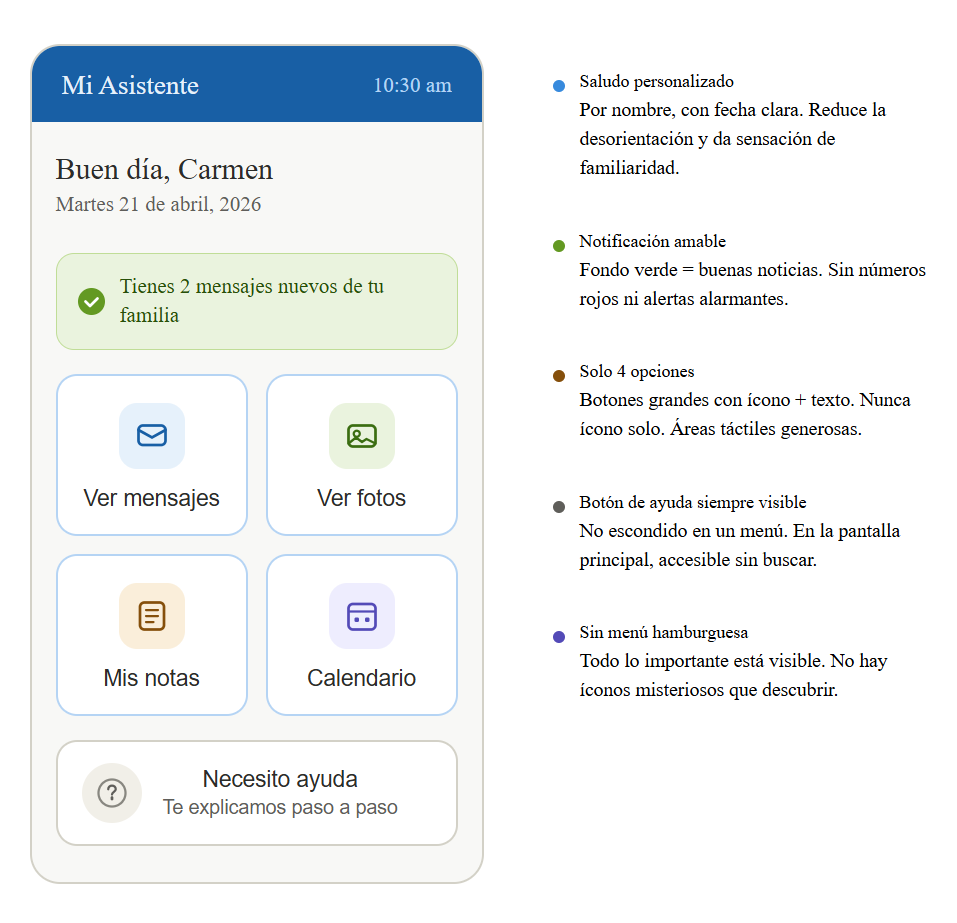
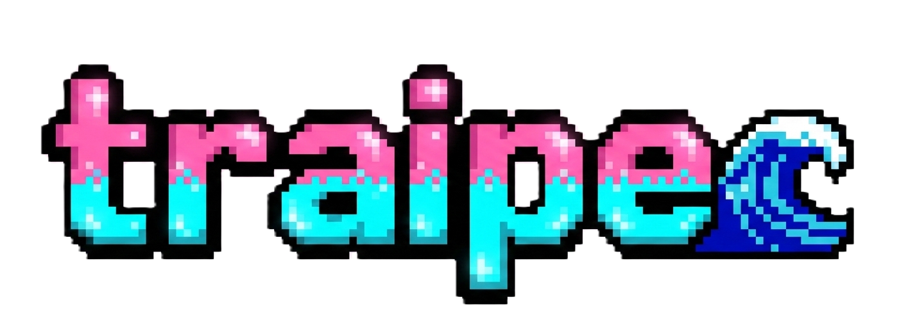

# mi-app-mayor
# Mi Asistente — App para adultos mayores

Una aplicación web diseñada para personas mayores que aprendieron a usar computadoras en los años 90. Construida con **Vue 3 + Vite + Vuetify**, con foco en accesibilidad, claridad visual y una experiencia amable que no genera ansiedad.

---

## 📸 Vista previa

> 

---

## 🎯 Contexto y motivación

Este proyecto nació de una pregunta de diseño concreta:

> ¿Cómo se diseña una app digital para alguien que sabe que las computadoras hacen cosas, pero desconfía de sí mismo para usarlas?

Las personas mayores que se alfabetizaron digitalmente en los años 90 tienen un modelo mental basado en Windows: carpetas, guardar, abrir, cerrar. No en íconos flotantes, menús hamburguesa, ni gestos de deslizamiento. Este proyecto parte de ese modelo mental y lo respeta.

El mayor obstáculo para este usuario no es la tecnología — es el **miedo a cometer un error irreversible**.

---

## 🧠 Principios de diseño aplicados

### 1. Botones que parecen botones
Ningún botón es solo un ícono. Cada acción interactiva tiene texto descriptivo visible ("Ver mensajes", no ✉️). Las áreas táctiles tienen mínimo 60×60px.

### 2. Máximo 3–4 opciones por pantalla
Menos opciones = menos parálisis = menos errores. La pantalla de inicio tiene exactamente 4 secciones principales.

### 3. Confirmación antes de acciones importantes
"¿Seguro que deseas enviar?" no es molesto para este usuario — es tranquilizador. Toda acción destructiva o definitiva pide confirmación.

### 4. Lenguaje humano, sin tecnicismos
Ningún mensaje dice "Error 503" o "Token expirado". Los errores explican qué pasó en lenguaje cotidiano y siempre indican qué hacer a continuación.

### 5. Retroalimentación inmediata y visible
El usuario siempre sabe si una acción funcionó. Los mensajes de éxito son grandes, claros y en color verde. No hay que adivinar si "algo pasó".

### 6. Botón de ayuda siempre presente
No está escondido en un menú de configuración. Está en la pantalla principal, grande, con texto que dice exactamente lo que hace.

### 7. Texto grande (mínimo 18px)
Alto contraste obligatorio. Fondo claro con texto oscuro. Sin texto gris decorativo diminuto.

### 8. Sin menú hamburguesa
Todo lo importante es visible directamente. El usuario no tiene que explorar para encontrar funciones.

---

## 🛠️ Stack tecnológico

| Herramienta | Versión | Por qué |
|---|---|---|
| [Vue 3](https://vuejs.org/) | ^3.4 | Sintaxis clara, Composition API, fácil de mantener |
| [Vite](https://vitejs.dev/) | ^5.0 | Arranque instantáneo, build optimizado |
| [Vuetify 3](https://vuetifyjs.com/) | ^3.5 | Componentes accesibles, botones configurables, temas |
| [Vue Router](https://router.vuejs.org/) | ^4.3 | Navegación entre pantallas sin recargar |
| [@mdi/font](https://materialdesignicons.com/) | ^7.0 | Íconos claros y reconocibles |

---

## 🚀 Cómo correr el proyecto localmente

### Requisitos previos

- [Node.js](https://nodejs.org/) v18 o superior
- npm v9 o superior

### Pasos

```bash
# 1. Clona el repositorio
git clone https://github.com/tu-usuario/mi-app-mayor.git
cd mi-app-mayor

# 2. Instala las dependencias
npm install

# 3. Inicia el servidor de desarrollo
npm run dev
```

Abre [http://localhost:5173](http://localhost:5173) en tu navegador.

### Build para producción

```bash
npm run build
```

Los archivos optimizados quedan en la carpeta `/dist`.

---

## 📁 Estructura del proyecto

```
src/
├── main.js               # Configuración de Vue + Vuetify
├── App.vue               # Componente raíz con router-view
├── router/
│   └── index.js          # Rutas de la aplicación
└── components/
    ├── HomeScreen.vue     # Pantalla de inicio (4 acciones principales)
    ├── Messages.vue       # Bandeja de mensajes familiares
    ├── Photos.vue         # Galería de fotos compartidas
    ├── Notes.vue          # Notas personales
    ├── Calendar.vue       # Calendario con recordatorios
    └── HelpScreen.vue     # Tutorial y ayuda paso a paso
```

---

## ♿ Accesibilidad

- Cumple con las pautas **WCAG 2.1 nivel AA**
- Contraste de color mínimo 4.5:1 en todo el texto
- Todos los botones tienen `aria-label` descriptivos
- Navegable por teclado
- Compatible con lectores de pantalla

---

## 🗺️ Roadmap

- [x] Pantalla de inicio con 4 secciones
- [x] Navegación básica entre pantallas
- [ ] Módulo de mensajes (envío y recepción)
- [ ] Galería de fotos con zoom accesible
- [ ] Tutorial interactivo de bienvenida
- [ ] Modo de texto extra grande (accesibilidad avanzada)
- [ ] Soporte PWA para instalar en tablet
- [ ] Tema oscuro con alto contraste

---

## 🤔 Decisiones de diseño documentadas

### ¿Por qué Vuetify y no Tailwind CSS?
Vuetify entrega componentes funcionales y accesibles desde el primer día. Tailwind requiere construir cada componente desde cero, lo que aumenta la probabilidad de errores de accesibilidad. Para este proyecto, los componentes prediseñados de Vuetify son una ventaja directa.

### ¿Por qué Vue Router en vez de múltiples apps?
La navegación por router mantiene el estado entre pantallas (por ejemplo, el saludo con nombre del usuario) y permite animaciones suaves de transición que evitan el "flashazo" de recarga que puede desorientar al usuario mayor.

### ¿Por qué no TypeScript?
Este proyecto prioriza la legibilidad del código. JavaScript puro con comentarios claros es más fácil de mantener para un equipo pequeño o para alguien que aprende el stack.

---

## 📄 Licencia

MIT — libre para usar, modificar y distribuir.

---

## 👤 Autor

Desarrollado por ****
- GitHub: [@traipe](https://github.com/traipe)

> _Si este proyecto te resulta útil o interesante, considera dejar una  🗝️ en el repositorio._